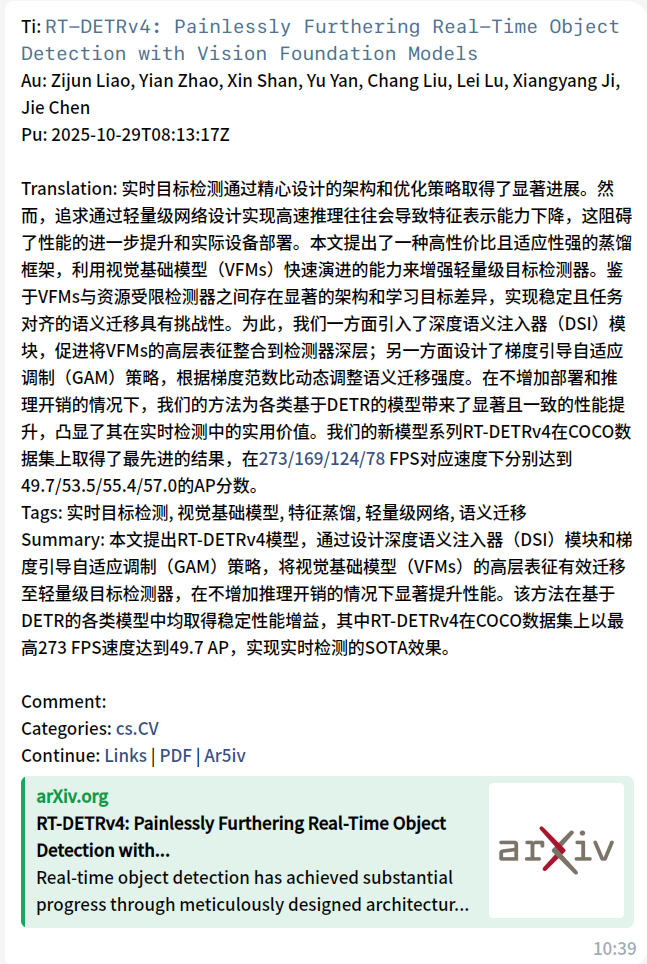

这是一个自动推送设定检索式的 telegram 机器人，旨在帮助用户获取最新前沿文章。



根据用户设定的时间，自动检索文章，并将新文章推送给用户。附带 AI 打 tag 和总结功能。推送效果如下：

```
Ti: RT-DETRv4: Painlessly Furthering Real-Time Object Detection with Vision Foundation Models
Au: Zijun Liao, Yian Zhao, Xin Shan, Yu Yan, Chang Liu, Lei Lu, Xiangyang Ji, Jie Chen
Pu: 2025-10-29T08:13:17Z

Translation: 实时目标检测通过精心设计的架构和优化策略取得了显著进展。然而，追求通过轻量级网络设计实现高速推理往往会导致特征表示能力下降，这阻碍了性能的进一步提升和实际设备部署。本文提出了一种高性价比且适应性强的蒸馏框架，利用视觉基础模型（VFMs）快速演进的能力来增强轻量级目标检测器。鉴于VFMs与资源受限检测器之间存在显著的架构和学习目标差异，实现稳定且任务对齐的语义迁移具有挑战性。为此，我们一方面引入了深度语义注入器（DSI）模块，促进将VFMs的高层表征整合到检测器深层；另一方面设计了梯度引导自适应调制（GAM）策略，根据梯度范数比动态调整语义迁移强度。在不增加部署和推理开销的情况下，我们的方法为各类基于DETR的模型带来了显著且一致的性能提升，凸显了其在实时检测中的实用价值。我们的新模型系列RT-DETRv4在COCO数据集上取得了最先进的结果，在273/169/124/78 FPS对应速度下分别达到49.7/53.5/55.4/57.0的AP分数。
Tags: 实时目标检测, 视觉基础模型, 特征蒸馏, 轻量级网络, 语义迁移
Summary: 本文提出RT-DETRv4模型，通过设计深度语义注入器（DSI）模块和梯度引导自适应调制（GAM）策略，将视觉基础模型（VFMs）的高层表征有效迁移至轻量级目标检测器，在不增加推理开销的情况下显著提升性能。该方法在基于DETR的各类模型中均取得稳定性能增益，其中RT-DETRv4在COCO数据集上以最高273 FPS速度达到49.7 AP，实现实时检测的SOTA效果。

Comment: 
Categories: cs.CV
Continue: Links (http://arxiv.org/abs/2510.25257v1) | PDF (http://arxiv.org/pdf/2510.25257v1) | Ar5iv (https://ar5iv.labs.arxiv.org/html/2510.25257v1)
```


requirement.txt

```
telegram
sqlalchemy
pyyaml
httpx
arxiv
python-telegram-bot
psycopg2
"python-telegram-bot[rate-limiter]"
"python-telegram-bot[socks]"
pysocks
```

重置数据库，数据库用的是postgres

```shell
psql -U postgres -d arxiv_bot
```

```sql
\d
DROP TABLE IF EXISTS paper_user_notify CASCADE;
DROP TABLE IF EXISTS papers CASCADE;
DROP TABLE IF EXISTS user_config CASCADE;
```
